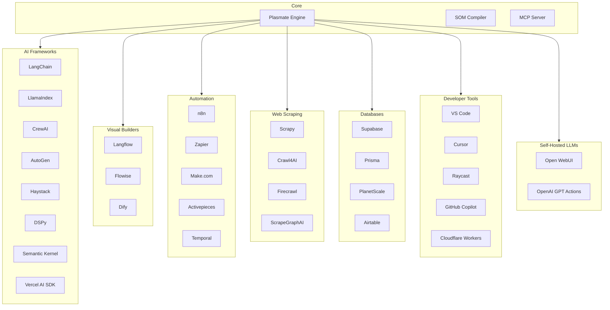

# Plasmate Ecosystem Diagram

## Mermaid Diagram (for docs/README)



## ASCII Art Version (for terminals/plain text)

```
                              ┌─────────────────┐
                              │    PLASMATE     │
                              │  Browser Engine │
                              └────────┬────────┘
                                       │
        ┌──────────────────────────────┼──────────────────────────────┐
        │                              │                              │
        ▼                              ▼                              ▼
┌───────────────┐            ┌─────────────────┐            ┌─────────────────┐
│ AI FRAMEWORKS │            │ VISUAL BUILDERS │            │   AUTOMATION    │
├───────────────┤            ├─────────────────┤            ├─────────────────┤
│ LangChain     │            │ Langflow        │            │ n8n             │
│ LlamaIndex    │            │ Flowise         │            │ Zapier          │
│ CrewAI        │            │ Dify            │            │ Make.com        │
│ AutoGen       │            └─────────────────┘            │ Temporal        │
│ Haystack      │                                           └─────────────────┘
│ DSPy          │
│ Semantic Kern │
│ Vercel AI     │
└───────────────┘

        ┌──────────────────────────────┼──────────────────────────────┐
        │                              │                              │
        ▼                              ▼                              ▼
┌───────────────┐            ┌─────────────────┐            ┌─────────────────┐
│  WEB SCRAPING │            │    DATABASES    │            │  DEVELOPER TOOLS│
├───────────────┤            ├─────────────────┤            ├─────────────────┤
│ Scrapy        │            │ Supabase        │            │ VS Code         │
│ Crawl4AI      │            │ Prisma          │            │ Cursor          │
│ Firecrawl     │            │ PlanetScale     │            │ Raycast         │
│ ScrapeGraphAI │            │ Airtable        │            │ GitHub Copilot  │
└───────────────┘            └─────────────────┘            │ Cloudflare      │
                                                            └─────────────────┘
```

## Badge for README

```markdown

```

## Category Stats

| Category | Count |
|----------|-------|
| AI Frameworks | 8 |
| Visual Builders | 3 |
| Automation | 5 |
| Web Scraping | 4 |
| Databases | 4 |
| Developer Tools | 5 |
| Self-Hosted LLMs | 2 |
| **Total** | **31 integrations** |
| + Quickstarts, Examples, Tools | **60 repos** |
